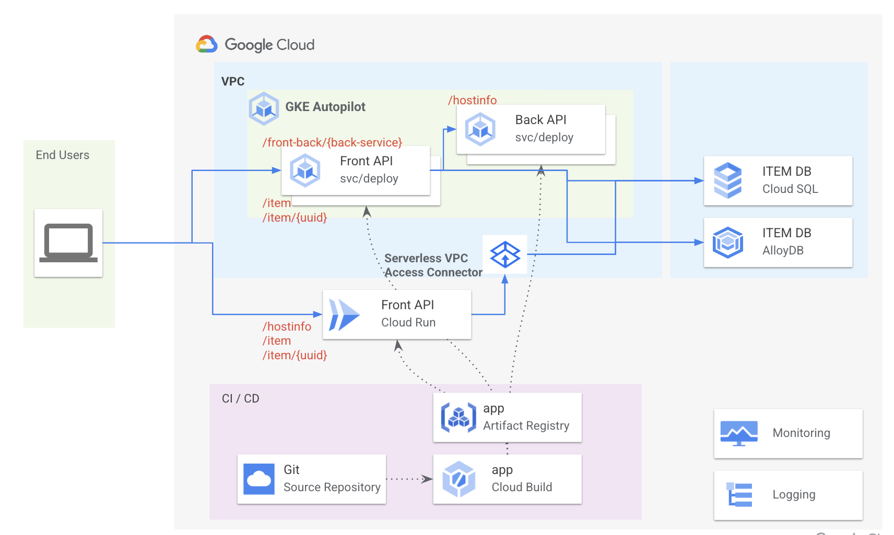

# アーキテクチャー概要

このサンプルでは以下のアーキテクチャーを想定したアプリケーションを提供する。


- 提供機能
  - マイクロサービスアーキテクチャー
    - サービス - サービス間の呼び出し
      - /fonrt-back/{back-service}
    - DB 呼び出し
      - /item
      - /item/{uuid}
    - コンテナ内で Pod や Cloud Run の情報取得
      - /hostinfo
  - 同じ機能を Cloud Run でも動かす
  - Git - Cloud Build - Artifact Registry 経由での CI/CD


開発アプリケーションとしては以下のフレームワークを想定する。
- Spring Boot
- DB アクセスは Spring JPA を利用

※JavaEE8 バージョンは[こちら](https://github.com/junyakitady/gke-javaee/)

※Quarkus バージョンは[こちら](https://github.com/junyakitady/gke-quarkus/)


# Cloud Run デプロイ手順
## プロジェクトの作成
新規のプロジェクトを作成し、開発メンバーなどにプロジェクトへの編集者権限を追加する。

## VPC ネットワークの作成
VPC ネットワークを作成する。
- 名前: `vpc-jp`
- サブネット: 
  - 名前: `subnet-tok`
  - リージョン: `asia-northeast1`
  - IPv4 レンジ: `10.140.0.0/20`
  - 限定公開のGoogleアクセス: `オン`
- デフォルト ファイアウォール ルール 選択して作成する

続いて、VPC ネットワーク > サーバーレス VPC アクセスより、VPC 内にサーバーレス VPC アクセスコネクタを作成する。
- 名前: `serverless-vpc-access-jp `
- リージョン: `asia-northeast1`
- ネットワーク: `vpc-jp`
- サブネット: `10.8.0.0/28`

## Cloud SQL / AlloyDB の作成
インスタンスを作成する。
 - インスタンス名: `noog`

データベースを作成する。
 - データベース名: `noogl`
 - Google 標準 SQL

アクセスするユーザを決定し、スキーマ、テーブルを作成する。
```
CREATE TABLE item (
uuid VARCHAR(36) PRIMARY KEY NOT NULL,
name VARCHAR(60) NOT NULL,
namejp VARCHAR(60),
brewery VARCHAR(40) NOT NULL,
type VARCHAR(3),
div VARCHAR(3),
itemno BIGINT,
price NUMERIC,
explanation VARCHAR(256),
regdate DATE,
timezone VARCHAR(32),
timestmp TIMESTAMP,
version TIMESTAMP
);
```
サンプルデータを用意する。
```
INSERT INTO item ( uuid, name, namejp, brewery, type, div, itemno, price, explanation, regdate, timezone, timestmp, version ) 
VALUES ('4ac8a11e-8189-4037-88ec-093bd3c1e0ba', 'Stone Happy 01.01.22', 'ストーンハッピー０１．０１．２３', 'Stone Brewery', '010', '100', 1111111111, 960.1, 'My first item', '2021-12-15', 'Asia/Tokyo', current_timestamp, current_timestamp),
('0084ee43-db66-460e-ba58-8182b154f3f8', 'Space Delux', 'スペース Delux', 'Space Brewery', '020', '200', 2222222222, 860.1, 'My second item', '2022-02-15', 'Asia/Tokyo', current_timestamp, current_timestamp),
('1fb4d57c-0aa6-48db-bd88-4385e2bb7e30', 'Stone Happy 31.09.22', 'ストーンハッピー３１．１０．２２', 'Stone Brewery', '030', '300', 3333333333, 860.1, 'My third item', '2022-03-14', 'Asia/Tokyo', current_timestamp, current_timestamp);
```

## サービスアカウントの作成
`db-client`という名で Spanner 接続用のサービスアカウントを作成する。(`db-client@{PROJECT_ID}.iam.gserviceaccount.com`)


## シークレットの作成
DB サーバーの情報を確認し、セキュリティ > Secret Manager より、以下のシークレットを作成する。
- 名前 `jdbc_url`
- 値 `jdbc:postgresql://<DB_HOST>:<DB_PORT>/<DB_NAME>?user=<DB_USER>&password=<DB_PASS>`

シークレット作成後、`db-client`サービスアカウントに`Secret Manager のシークレット アクセサー`のアクセス権を付与する。

## ソースリポジトリの作成
https://github.com/junyakitady/gke-spring/ をベースして、Github もしくは Source Repositiry にクローンを作成する。

## Artifact Registry の作成
Artifact Registry API と、脆弱性スキャンを有効にする。

新規のリポジトリを作成する。
- 名前 `app`
- 形式 `Docker`
- リージョン `asia-northeast1（東京）`

## Cloud Build の設定
Cloud Build > トリガー より以下のトリガーを作成する。
- 名前 `gke-spring-run`
- リージョン `asia-northeast1`
- リポジトリ: ソースを保持するリポジトリと連携させる
- ブランチ `develop`
- Cloud Build 構成ファイル `cloudbuild.yaml`
- 代入変数を追加 `TAG_NAME`:`latest`

## ビルドの実施
必要に応じてソースファイルの内容を更新し、commit & push を行う。

更新がない場合は、Cloud Build のトリガーより手動にてキックする。

## Cloud Run サービスの確認
ビルド完了後 Cloud Run サービスを確認する。

以下のオプションが設定されていることを確認する。
- Ingress `すべてのトラフィックを許可する`
- 認証 `未認証の呼び出しを許可`
- コンテナポート `8080`
- サーバーレス VPC アクセスコネクタ 経由で VPC に接続されている
- サービス アカウント `db-client`

Cloud Run サービスの URL を確認し、以下のパスに対して動作確認を行う。
- /hostinfo
- /item
- /item/{uuid}
